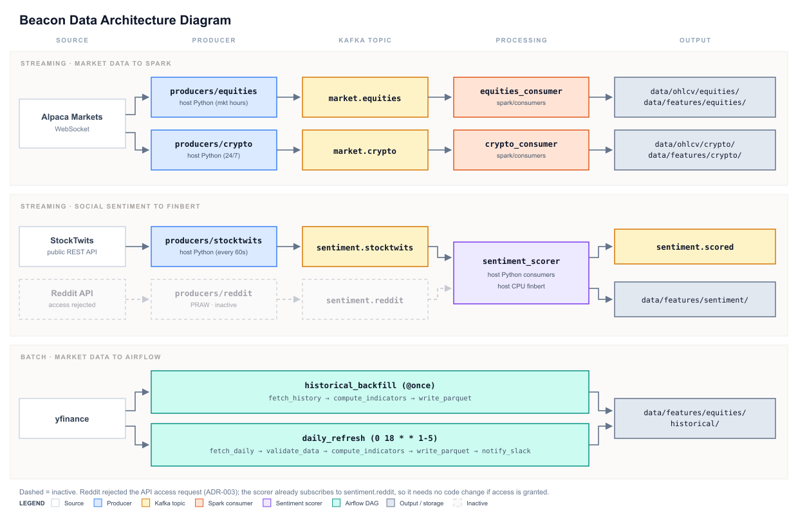
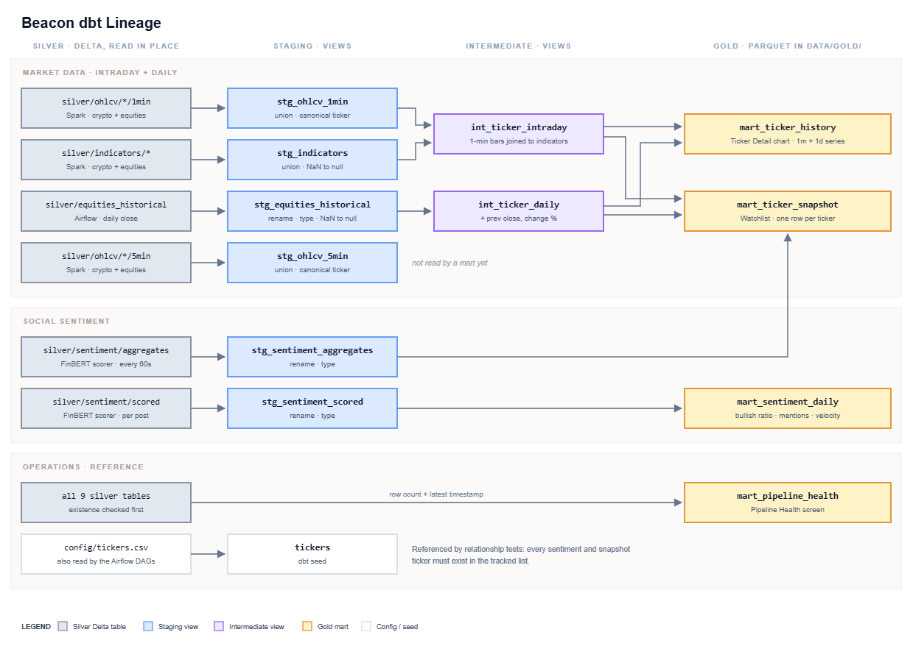

# Beacon 
### Real-Time Financial Market Intelligence Platform


Beacon is a real-time financial market intelligence platform that ingests live market data, processes it through a streaming pipeline, and surfaces actionable research insights via a dashboard and AI agent interface.


## Data Architecture
<details>
<summary>Architecture graph</summary>



</details>

<br>

**Current stack:**
- **Ingestion:** Alpaca Markets WebSocket (equities + crypto), StockTwits REST polling → Apache Kafka
- **Topics:** `market.equities`, `market.crypto`, `sentiment.reddit`, `sentiment.stocktwits`, `sentiment.scored` 
- **Processing:** PySpark Structured Streaming, FinBERT sentiment scoring
- **Orchestration:** Apache Airflow 
- **Storage:** Parquet (local); dbt + Delta Lake + DuckDB + Snowflake *(Phase 3)*
- **ML:** FinBERT sentiment, Isolation Forest anomaly detection *(Phase 3)*
- **Serving:** FastAPI + Streamlit + MCP server *(Phase 4)*

## Data Storage

<details>
<summary>dbt lineage graph </summary>


</details>

<br>

Beacon uses a medallion layout under `data/`. Each layer has one job and one set of readers.

| Layer | Contents | Written by | Read by |
|---|---|---|---|
| **Bronze** `data/bronze/kafka/` | Raw market messages | `bronze_consumer` (Spark) | Replay and debugging, rebuilding silver |
| **Silver** `data/silver/` | OHLCV bars, indicators, daily equity history, scored posts, sentiment aggregates | Spark consumers, Airflow DAGs, FinBERT scorer | dbt staging models |
| **Gold** `data/gold/` | dbt marts | dbt | Dashboard, feature store, MCP server |

dbt reads the silver Delta tables in place (DuckDB `delta_scan()`), builds staging and
intermediate views, and writes the gold marts as Parquet to `data/gold/`. To generate lineage
docs, run
```bash
docker exec beacon-dbt dbt docs generate --static
```
then open
```bash
dbt/target/static_index.html
```


## Project Structure

```
beacon/
├── producers/                  
│   ├── equities/               # Alpaca WebSocket → market.equities
│   ├── crypto/                 # Alpaca WebSocket → market.crypto
│   ├── stocktwits/             # StockTwits REST poll → sentiment.stocktwits
│   └── reddit/                 # PRAW → sentiment.reddit (inactive)
├── spark/                     
│   ├── consumers/              # Structured Streaming jobs: OHLCV bars + indicators
│   ├── common/                 # Shared Delta helpers: merge, symbol sanitization
│   ├── indicators/             # SMA, RSI, Bollinger Bands, MACD
│   └── Dockerfile
├── consumers/                  # Standalone Python consumers
│   └── sentiment_scorer/       # FinBERT scoring: sentiment.scored + aggregates
├── airflow/
│   ├── dags/                   # historical_backfill, daily_refresh, lakehouse_maintenance
│   └── Dockerfile
├── config/tickers.csv          # Tracked equities for Airflow, dbt seeds
├── docs/adr/                   # Architecture Decision Records
├── data/                       # Lakehouse (gitignored): bronze/; silver; gold;
├── dbt/                        # dbt-core + duckDB for delta_scan()
└── docker-compose.yml
```

## Running Locally

**Prerequisites:** Docker Desktop, Python 3.13

**1. Clone the repo**
```bash
git clone https://github.com/Carson-Lam/Beacon.git
cd Beacon
```

**2. Set up environment variables**
```bash
cp .env.example .env
# Fill in your Alpaca API keys
```

**3. Start Kafka infrastructure**
```bash
docker compose up -d
```

**4. Run a producer**
```bash
# Crypto (24/7)
pip install -r producers/crypto/requirements.txt
python producers/crypto/producer.py

# Equities (market hours only)
pip install -r producers/equities/requirements.txt
python producers/equities/producer.py
```

**5. Run the Spark streaming consumer**
```bash
docker compose up -d spark-master spark-worker

# Bronze data lakehouse
docker exec -it beacon-spark-master /opt/spark/bin/spark-submit \
  --packages org.apache.spark:spark-sql-kafka-0-10_2.12:3.5.1,io.delta:delta-spark_2.12:3.2.0 \
  /opt/spark-apps/consumers/bronze_consumer.py

# Crypto (24/7)
docker exec -it beacon-spark-master spark-submit \
  --packages org.apache.spark:spark-sql-kafka-0-10_2.12:3.5.1,io.delta:delta-spark_2.12:3.2.0 \
  /opt/spark-apps/consumers/crypto_consumer.py

# Equities (market hours only)
docker exec -it beacon-spark-master spark-submit \
  --packages org.apache.spark:spark-sql-kafka-0-10_2.12:3.5.1,io.delta:delta-spark_2.12:3.2.0 \
  /opt/spark-apps/consumers/equities_consumer.py
```
Spark master UI: http://localhost:8080 

Raw messages land in (`data/bronze/kafka/`). Bars go to (`data/silver/ohlcv/`), indicators to (`data/silver/indicators/`).

**6. Run the sentiment pipeline**

Run each in its own terminal from the repository's root.
```bash
# StockTwits producer
pip install -r producers/stocktwits/requirements.txt
python producers/stocktwits/producer.py

# FinBERT scorer (reads sentiment.reddit + sentiment.stocktwits)
pip install torch --index-url https://download.pytorch.org/whl/cpu
pip install -r consumers/sentiment_scorer/requirements.txt
python consumers/sentiment_scorer/consumer.py

```
The Reddit producer (`producers/reddit/`) is implemented but inactive. Reddit rejected the API access request (see ADR-003). 

**First run is slower.** FinBERT runs on CPU and downloads ~440MB of model weights from the HuggingFace Hub on first launch. 

Scored posts are published to (`sentiment.scored`) and written to (`data/silver/sentiment/scored/`). Aggregates are written every 60 seconds to (`data/silver/sentiment/aggregates/`).

**7. Run the Airflow DAGs**
```bash
docker compose up -d --build airflow-init airflow-webserver airflow-scheduler
```
UI accessible at http://localhost:8082 (Login: 'admin' / 'admin'). Trigger `historical_backfill`, then `daily_refresh`.

| DAG | Schedule | Action |
|---|---|---|
| `historical_backfill` | `@once` (manual) | 2 years of daily OHLCV per ticker, computes indicators |
| `daily_refresh` | `0 18 * * 1-5` | Latest trading day, validated, merged into history |
| `lakehouse_maintenance` | `0 2 * * *` | Compacts small files and removes unreferenced files older than 7 days |


## Architectural Decision Records
- [ADR-001: Kafka as the Streaming Backbone](docs/adr/ADR-001-kafka-over-polling.md)
- [ADR-002: Reddit Sentiment Ingestion](docs/adr/ADR-002-reddit-sentiment-ingestion.md)
- [ADR-003: Social Sentiment Data Sources](docs/adr/ADR-003-social-sentiment-evaluation.md)
- [ADR-004: Spark Structured Streaming vs. Flink](docs/adr/ADR-004-spark-vs-flink.md)